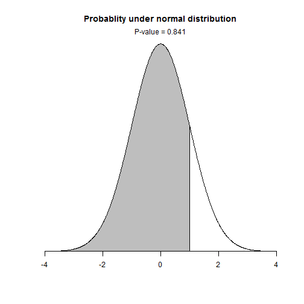

## Introduction

This is a short presentation of the Shiny App developed for the Coursera "Developing Data Products" course's project, made with Slidify.

--- .class #id 

## About the app

I create a simple app to calculate the p-valua for the mean, sd and sample mean provided by the user. The app also plots the area below or above the sample mean under the normal distribution.


--- .class #id 

## The app in action

<iframe style="height:525px" src="https://mikelmadina.shinyapps.io/shiny/"></iframe>


--- .class #id 

## Slide 4

This is a simplyfied code on the server.R file, with the values harcoded (no user inputs).


```r
mean = 0 ; sd = 1; comp = 1; x <- seq(-4, 4, length=1000); hx <- dnorm(x); lb = min(x) ; ub = 1 ;
plot(x, hx, type="l", xlab="", ylab="", main="Probablity under normal distribution", axes=F)
i <- x >= lb & x <= ub; lines(x, hx); polygon(c(lb,x[i],ub), c(0,hx[i],0), col="grey"); area <- pnorm(ub, 0, 1) - pnorm(lb, 0,1)
result <- paste("P-value =", signif(area, digits=3)); mtext(result,3); axis(1, pos=0) 
```

 


--- .class #id 

## Thank you for your attention


--- .class #id 


